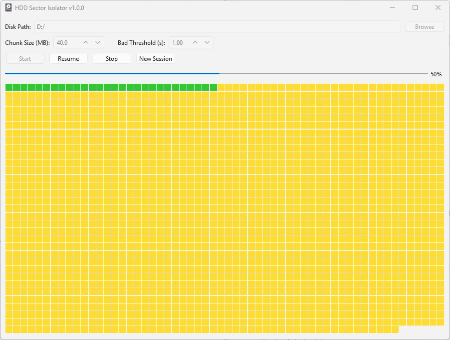

# pyHDDSectorIsolation

Windows desktop utility (PySide6) for stress-writing disk space in fixed-size chunks to help identify slow or failing areas.



## What it does

- Splits free space on a selected target path into chunks (default: 40 MB).
- Runs a **2-phase scan**:
  - **Phase 1 - Allocation:** creates chunk files to reserve space (`white -> yellow`).
  - **Phase 2 - Verification:** writes each chunk and measures write time (`yellow -> green/red`).
- Marks chunks as:
  - `green` = write time below threshold
  - `red` = write failed or exceeded threshold
- Persists progress to `session_state.json` so interrupted sessions can be resumed.

## Important warning

This tool performs real write operations and can consume most free space on the selected target path. Use it only on disks/folders you are intentionally testing.

## Requirements

- Windows
- Python 3.x
- `pip`
- Dependencies from `requirements.txt`:
  - `PySide6`

## Quick start

### Option A: Use the provided installer script

```powershell
.\Install.bat
```

This creates `venv`, links `activate.bat`, upgrades `pip`, and installs requirements.

### Option B: Manual setup

```powershell
python -m venv venv
.\venv\Scripts\Activate.ps1
python -m pip install --upgrade pip
python -m pip install -r requirements.txt
```

## Run from source

```powershell
.\venv\Scripts\Activate.ps1
python .\main.py
```

## How to use

1. Select a valid target folder/disk path.
2. Set chunk size (MB).
3. Set bad threshold (seconds).
4. Click **Start**.
5. Optional during run:
   - **Pause/Resume**
   - **Stop** (state is saved)
   - Resume prompt appears on next launch if a session exists.
6. Use **New Session** to clear saved state and start fresh.

## Output and state files

- `sectors/` (under selected target path): chunk files named like `00000000000000000001.dat`
- `session_state.json` (repo directory): persisted scan/session metadata

## Build executable (PyInstaller)

```powershell
.\BUILD_release.bat
```

Build config is in `main.spec`.

## Project entry points

- `main.py` - Qt app startup
- `frontend.py` - GUI and user interactions
- `backend.py` - scanning worker, status updates, and session persistence